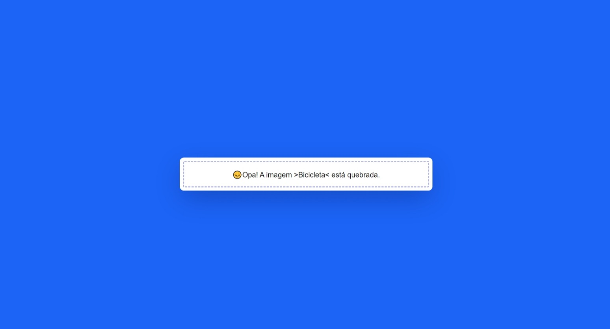

# Estilização para Imagem Quebrada

A estilização feita só será reproduzida caso a imagem que esteja sendo chamada esteja quebrada/não exista.

Preview com a imagem funcionando:

Preview com a imagem quebrada:

